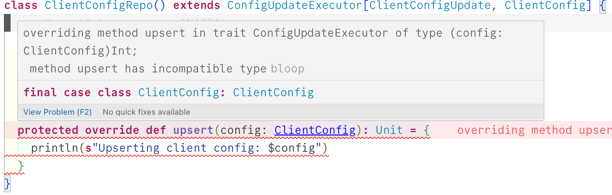

# Erase

## Problem

Compilation errors you will see:

**`abstract type C in type pattern ConfigUpdate.Upsert[C] is unchecked since it is eliminated by erasure`** in [`ConfigUpdateExtractor.scala`](src/main/scala/ConfigUpdateExtractor.scala)

Let us say we make the following change:

```scala
case u: Upsert[_] => upsert(u.config)
```

This is not much different from the earlier code but at least you don't get the above error. You get a different error on `upsert(u.config)`:

```text
type mismatch;
found
:u.config.type (with underlying type -)
required: C
```

... which is understandable because `_` is not the same as `C`

We could do this to get rid of the above error, which is not necessarily a good idea:

```scala
u.config.asInstanceOf[C]
```

... because even with `.asInstanceOf[C]`, error in other places are not resolved.



A better way to deal with all this may be pattern matching directly on `ClientConfigUpsert` and `ClientParentConfigUpsert`. But is there is a way to do it with using `Upsert` trait.

So, the overall goal is to explore the right / better way of doing whatever is done in the code.

## Solution

> Fix for this issue is on a different [**branch**](https://github.com/assayire/erase/tree/fixed)
